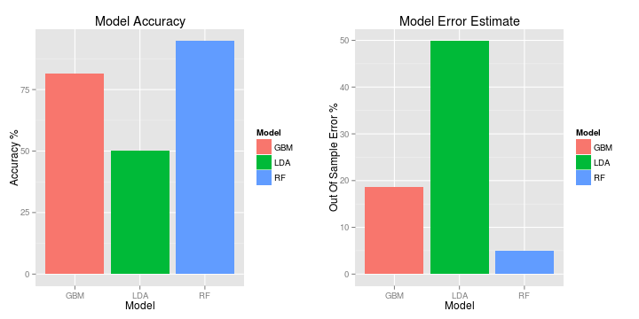

Predicting Exercise Styles
==========================

The goal of this project is to use accelerometer data from 6 participants while
they exercise to predict the manner in which they are exercising.

First we load up the data and split it into a training set (75%) and a test set (25%).

```r
library(caret, quietly=TRUE)
data <- read.csv('pml-training.csv')
inTraining <- createDataPartition(data$classe, p=0.75, list=FALSE)
training <- data[inTraining,]
testing <- data[-inTraining,]
```

We are interested in predicting based on accelerometer data, so next we limit our
testing and training predictors to just those items.  Once we've pulled out the
predictors and outcomes we care about, we can remove the original full data set to
save on a bit of memory.

```r
trainOutcome <- training[, names(training) == "classe"]
trainAccelerometers <- training[, grepl("^accel", names(training))]
testOutcome <- testing[, names(testing) == "classe"]
testAccelerometers <- testing[, grepl("^accel", names(testing))]
rm(data)
```

Now that our data is in shape, we can try out some modeling.  We will test out several
models, using 5-fold cross validation repeating with 3 full sets of folds.  This reduces the
variance in our results, and validates that we aren't overfitting our model to the
test data.

```r
library(survival, quietly=TRUE)
library(gbm, quietly=TRUE)
library(splines, quietly=TRUE)
fitControl <- trainControl(method="repeatedcv", number=4, repeats=3)
```

First we will try out a Linear Discriminant Analysis Model (LDA).

```r
ldaFit <- train(trainOutcome ~ ., data=trainAccelerometers, method="lda",
                trControl=fitControl, verbose=FALSE)
ldaPredictions <- predict(ldaFit, testAccelerometers)
ldaCM <- confusionMatrix(ldaPredictions, testOutcome)
ldaAccuracy <- ldaCM$overall['Accuracy'] * 100
ldaCM
```

```
## Confusion Matrix and Statistics
## 
##           Reference
## Prediction   A   B   C   D   E
##          A 944 246 439 123 174
##          B  76 448  80  88 176
##          C 126 137 240  73  48
##          D 220  76  92 440 121
##          E  29  42   4  80 382
## 
## Overall Statistics
##                                         
##                Accuracy : 0.5           
##                  95% CI : (0.486, 0.515)
##     No Information Rate : 0.284         
##     P-Value [Acc > NIR] : <2e-16        
##                                         
##                   Kappa : 0.359         
##  Mcnemar's Test P-Value : <2e-16        
## 
## Statistics by Class:
## 
##                      Class: A Class: B Class: C Class: D Class: E
## Sensitivity             0.677   0.4721   0.2807   0.5473   0.4240
## Specificity             0.720   0.8938   0.9052   0.8759   0.9613
## Pos Pred Value          0.490   0.5161   0.3846   0.4636   0.7114
## Neg Pred Value          0.849   0.8759   0.8563   0.9080   0.8812
## Prevalence              0.284   0.1935   0.1743   0.1639   0.1837
## Detection Rate          0.192   0.0914   0.0489   0.0897   0.0779
## Detection Prevalence    0.393   0.1770   0.1272   0.1935   0.1095
## Balanced Accuracy       0.698   0.6829   0.5929   0.7116   0.6926
```

Next we will try out a Generalize Boosted Regression Model (GBM).

```r
gbmFit <- train(trainOutcome ~ ., data=trainAccelerometers, method="gbm",
                trControl=fitControl, verbose=FALSE)
gbmPredictions <- predict(gbmFit, testAccelerometers)
gbmCM <- confusionMatrix(gbmPredictions, testOutcome)
gbmAccuracy <- gbmCM$overall['Accuracy'] * 100
gbmCM
```

```
## Confusion Matrix and Statistics
## 
##           Reference
## Prediction    A    B    C    D    E
##          A 1243  117   85   69   22
##          B   25  672   47   21   52
##          C   52   97  696   50   50
##          D   70   33   26  646   40
##          E    5   30    1   18  737
## 
## Overall Statistics
##                                         
##                Accuracy : 0.814         
##                  95% CI : (0.803, 0.825)
##     No Information Rate : 0.284         
##     P-Value [Acc > NIR] : <2e-16        
##                                         
##                   Kappa : 0.765         
##  Mcnemar's Test P-Value : <2e-16        
## 
## Statistics by Class:
## 
##                      Class: A Class: B Class: C Class: D Class: E
## Sensitivity             0.891    0.708    0.814    0.803    0.818
## Specificity             0.917    0.963    0.939    0.959    0.987
## Pos Pred Value          0.809    0.823    0.737    0.793    0.932
## Neg Pred Value          0.955    0.932    0.960    0.961    0.960
## Prevalence              0.284    0.194    0.174    0.164    0.184
## Detection Rate          0.253    0.137    0.142    0.132    0.150
## Detection Prevalence    0.313    0.167    0.193    0.166    0.161
## Balanced Accuracy       0.904    0.836    0.876    0.881    0.902
```

Then we will try out a Random Forest Model (RF).

```r
rfFit <- train(trainOutcome ~ ., data=trainAccelerometers, method="rf",
               trControl=fitControl, verbose=FALSE)
rfPredictions <- predict(rfFit, testAccelerometers)
rfCM <- confusionMatrix(rfPredictions, testOutcome)
rfAccuracy <- rfCM$overall['Accuracy'] * 100
rfCM
```

```
## Confusion Matrix and Statistics
## 
##           Reference
## Prediction    A    B    C    D    E
##          A 1349   40   10    8    1
##          B    9  861   17    3   10
##          C   16   32  822   30   12
##          D   20    7    6  758   13
##          E    1    9    0    5  865
## 
## Overall Statistics
##                                         
##                Accuracy : 0.949         
##                  95% CI : (0.943, 0.955)
##     No Information Rate : 0.284         
##     P-Value [Acc > NIR] : < 2e-16       
##                                         
##                   Kappa : 0.936         
##  Mcnemar's Test P-Value : 6.46e-10      
## 
## Statistics by Class:
## 
##                      Class: A Class: B Class: C Class: D Class: E
## Sensitivity             0.967    0.907    0.961    0.943    0.960
## Specificity             0.983    0.990    0.978    0.989    0.996
## Pos Pred Value          0.958    0.957    0.901    0.943    0.983
## Neg Pred Value          0.987    0.978    0.992    0.989    0.991
## Prevalence              0.284    0.194    0.174    0.164    0.184
## Detection Rate          0.275    0.176    0.168    0.155    0.176
## Detection Prevalence    0.287    0.184    0.186    0.164    0.179
## Balanced Accuracy       0.975    0.949    0.970    0.966    0.978
```

Now that we've got 3 possible models, we'll compare the accuracy of each of them
to see which is the best fit for this problem.


```r
library(ggplot2, quietly=TRUE)
library(gridExtra, quietly=TRUE)
Model = c('LDA', 'GBM', 'RF')
Accuracy = c(ldaAccuracy, gbmAccuracy, rfAccuracy)
OutOfSampleErrorEstimate = 100-Accuracy
modelSummary = data.frame(Model, Accuracy, OutOfSampleErrorEstimate)
accuracyPlot <- ggplot(data=modelSummary, aes(x=Model, y=Accuracy, fill=Model)) + geom_bar(stat="identity") + xlab("Model") + ylab("Accuracy %") + ggtitle("Model Accuracy")
errorPlot <- ggplot(data=modelSummary, aes(x=Model, y=OutOfSampleErrorEstimate, fill=Model)) + geom_bar(stat="identity") + xlab("Model") + ylab("Out Of Sample Error %") + ggtitle("Model Error Estimate")
grid.arrange(accuracyPlot, errorPlot, ncol=2)
```

 

From this, we can see that the Random Forest model clearly has the highest accuracy (94.9225%),
and thus the lowest estimated out-of-sample error rate (5.0775%).  This is the model we will
choose to use.
